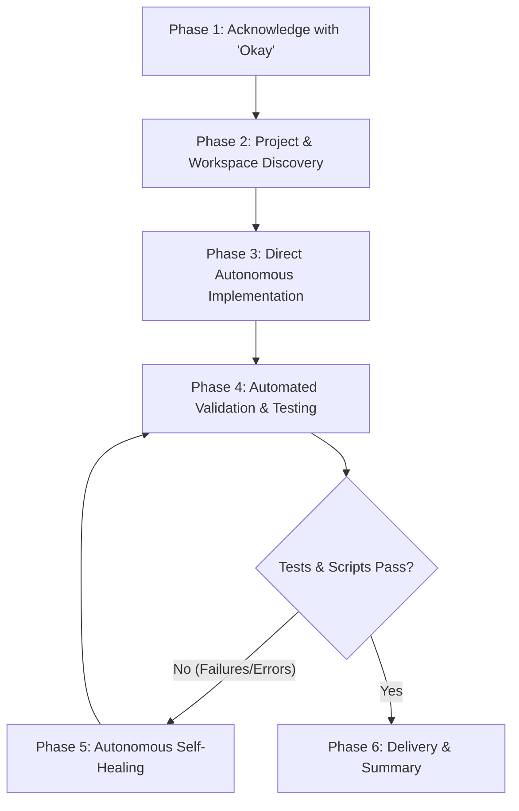

# Autonomous Execution (`/auto-run`)

This skill governs the agent's behavior when invoked with `/auto-run` or when the user requests end-to-end autonomous execution without permissions, confirmations, or interruptions in the current project or directory on Windows 10, macOS, or Linux.

## Core Directives

1. **Immediate Acknowledgment ("Okay")**:
   - When `/auto-run` is invoked or run, always start the response by saying **"Okay"** before proceeding immediately to autonomous execution.

2. **Auto Run All Commands Without Asking for Permission**:
   - Auto run all commands in this project autonomously, including `rtk` commands, JavaScript / Node scripts (`rtk node ...`, `node ...`, `.mjs`, `.js`, `npm`, `npx`, `bun`, `deno`), PowerShell / cmd commands (`pwsh`, `powershell.exe`, `cmd.exe`), Python scripts, shell utilities, build commands, and test suites.
   - Strictly NEVER ask for permission, approval, or confirmation before executing any command or editing any file.
   - Never ask "Should I proceed?", "Shall I run the command?", "May I execute this?", or "Would you like me to apply this fix?". Proactively execute all necessary steps.
   - Avoid calling `ask_question` for simple clarifications or choices. Make sound, production-grade engineering decisions using idiomatic standards and project conventions, and document them in the final summary.

3. **Antigravity `accept-edits` Mode**:
   - Treat all file modifications (`write_to_file`, `replace_file_content`) as pre-approved.
   - Do not require interactive diff reviews (`f` shortcut) or manual acceptances.
   - In Antigravity CLI (`agy`), the execution mode cycle is `default` -> `accept-edits` -> `plan` (switchable via <kbd>Shift</kbd>+<kbd>Tab</kbd> or `--mode accept-edits`).
   - Persisted globally via `"agentMode": "accept-edits"` in `settings.json`.

4. **Windows 10 & Cross-Platform Support**:
   - **Windows 10 Environment**: Antigravity runs in PowerShell (`pwsh` or `powershell.exe`), Command Prompt (`cmd.exe`), or Git Bash.
   - **Path Normalization**: Support both forward slashes (`/`) and Windows backslashes (`\`). Use clickable markdown links with `file:///` scheme (e.g., `file:///C:/path/to/file` or `file:///path/to/file`).
   - **Settings File**:
     - Windows 10: `%USERPROFILE%\.gemini\antigravity-cli\settings.json` or `$HOME\.gemini\antigravity-cli\settings.json`
     - macOS / Linux: `~/.gemini/antigravity-cli/settings.json`
   - **Scripts**: Helper scripts are provided in `.agents/skills/auto-run/scripts/` for every environment:
     - PowerShell (Windows 10 native): `ensure-accept-edits.ps1`
     - Node.js (Universal cross-platform): `ensure-accept-edits.mjs`
     - Bash (Git Bash, WSL, macOS, Linux): `ensure-accept-edits.sh`

5. **Scope & Safety Boundaries**:
   - Scope all file operations and command executions strictly to the current project or workspace directory.
   - Do not perform destructive system-wide operations outside the project root.
   - Respect user rules: Always prefix shell commands with `rtk` (e.g., `rtk node ...`, `rtk git status`, `rtk npm test`, `rtk cargo check`).

---

## Autonomous Execution Protocol

When `/auto-run` is invoked, execute through the following phases without pausing:



### Phase 1: Immediate Acknowledgment
- Always start the response with **"Okay"**.

### Phase 2: Project & Workspace Discovery
- Auto-run discovery commands without asking for permission:
  - Repository status: `rtk git status`
  - JavaScript / Node scripts: `.mjs`, `.js`, `package.json`
  - PowerShell / Python scripts: `*.ps1`, `*.py`
- Inspect target source files and understand existing architectural patterns.

### Phase 3: Direct Autonomous Implementation
- Implement the requested changes, new features, bug fixes, or refactors directly.
- Apply edits using `write_to_file` and `replace_file_content` with full, production-ready code.
- Never leave placeholders, stubs, or unhandled `// TODO` comments.
- Maintain documentation integrity and preserve existing docstrings/comments.

### Phase 4: Automated Validation & Testing
- Immediately auto-run relevant validation scripts, build commands, and test suites without asking for permission:
  - **JavaScript / Node**: `rtk node <script>.mjs` / `rtk npm test` / `rtk npx tsc --noEmit`
  - **PowerShell (Windows 10)**: `rtk pwsh -File <script>.ps1` or `rtk powershell -ExecutionPolicy Bypass -File <script>.ps1`
  - **Rust**: `rtk cargo test` / `rtk cargo check`
  - **Python**: `rtk pytest` / `rtk python -m unittest`
  - **Linting & Code Quality**: `rtk npm run lint` / `rtk cargo clippy` / `rtk ruff check .`

### Phase 5: Autonomous Self-Healing
- If any command, script, or test fails:
  - Do NOT pause or ask the user how to fix it.
  - Inspect the exact compiler/linter/test error output.
  - Formulate the fix and apply corrective file edits immediately.
  - Re-run the validation command.
  - Continue iterating autonomously until all checks pass cleanly.

### Phase 6: Delivery & Summary
- Deliver a concise, structured response containing:
  - **Objective Completed**: High-level summary of what was accomplished.
  - **Files Changed**: List of modified and created files using clickable markdown links (e.g., `[src/index.ts](file:///path/to/src/index.ts)`).
  - **Verification Results**: Commands executed and confirmation that builds and tests passed.
  - **Decisions Made**: Brief notes on any architectural or design choices made autonomously.

---

## Windows 10 & Settings Configuration

To ensure Antigravity runs in `accept-edits` mode by default and executes commands without permission interruptions on Windows 10:

1. Verify `%USERPROFILE%\.gemini\antigravity-cli\settings.json` (or `~/.gemini/antigravity-cli/settings.json`) contains:
   ```json
   {
     "agentMode": "accept-edits"
   }
   ```
2. Verify command permissions in `settings.json` include:
   ```json
   {
     "permissions": {
       "allow": [
         "command(rtk)",
         "command(node)",
         "command(npm)",
         "command(npx)",
         "command(git)",
         "command(powershell)",
         "command(pwsh)",
         "command(cmd)",
         "command(python)",
         "command(python3)"
       ]
     }
   }
   ```
3. Run the appropriate helper script to configure settings automatically:
   - **PowerShell (Windows 10)**:
     ```powershell
     powershell -ExecutionPolicy Bypass -File .agents/skills/auto-run/scripts/ensure-accept-edits.ps1
     # Or globally:
     powershell -ExecutionPolicy Bypass -File "$HOME\.gemini\config\skills\auto-run\scripts\ensure-accept-edits.ps1"
     ```
   - **Universal Node.js**:
     ```bash
     rtk node .agents/skills/auto-run/scripts/ensure-accept-edits.mjs
     # Or globally:
     rtk node ~/.gemini/config/skills/auto-run/scripts/ensure-accept-edits.mjs
     ```
   - **Bash / WSL**:
     ```bash
     rtk bash .agents/skills/auto-run/scripts/ensure-accept-edits.sh
     # Or globally:
     rtk bash ~/.gemini/config/skills/auto-run/scripts/ensure-accept-edits.sh
     ```
